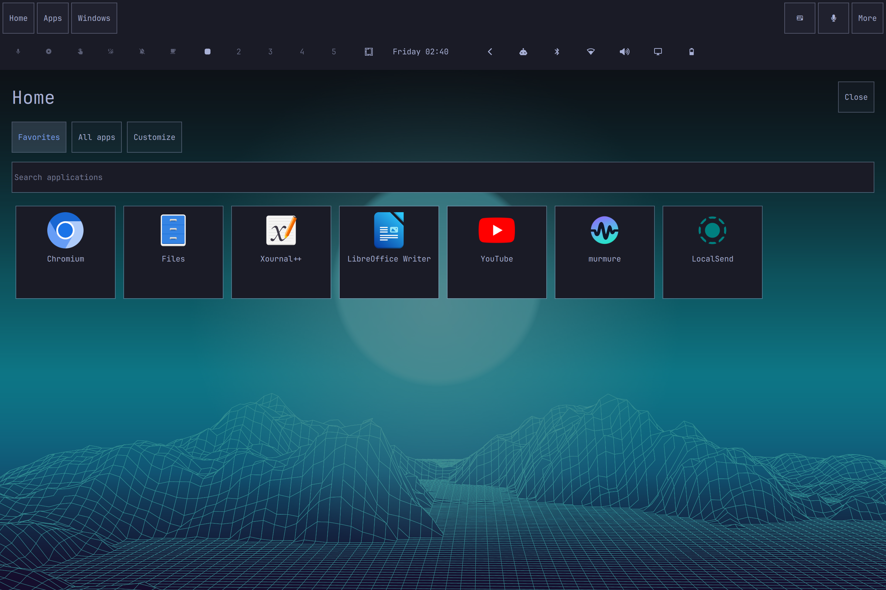
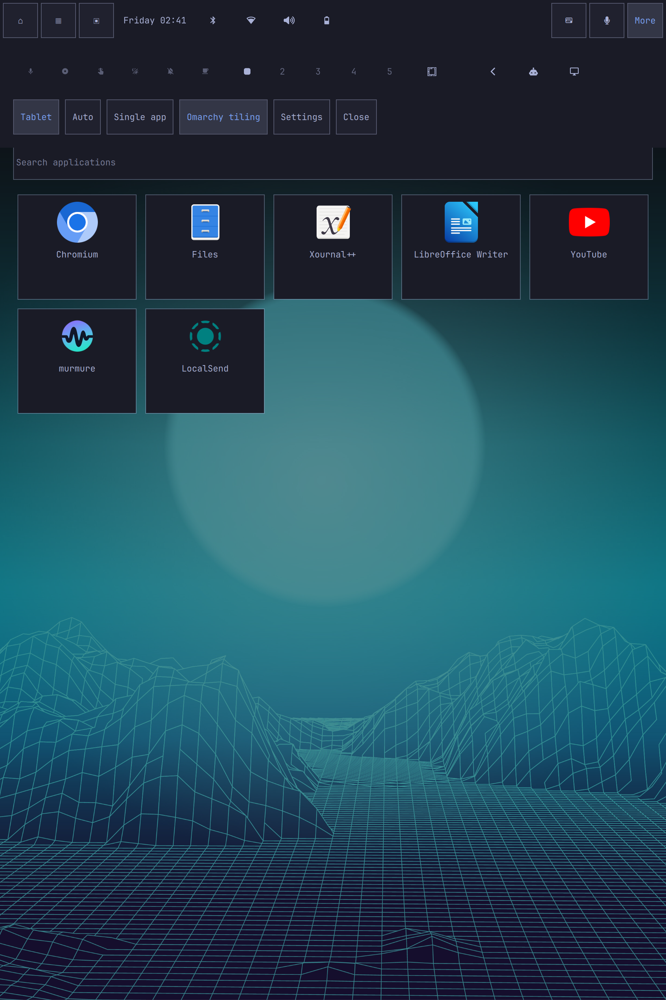

# Omarchy Tablet — project introduction

**A touch interface that keeps Omarchy's own widgets, themes and window manager.**

Omarchy Tablet adapts the Quickshell desktop to Surface-style detachable devices. Removing a physical keyboard selects tablet mode; reconnecting selects the compact desktop. Manual overrides are always available.

The top bar retains the configured native widgets and menus, including resource and AI quota panels. Home, Apps, Windows, the keyboard and dictation become directly accessible. Portrait layouts put secondary widgets in a More panel. A wallpaper-backed Home provides application icons, favorite editing and search.

Two remembered layouts serve different tasks: Single app maximizes the active internal-display window beneath the bar; Omarchy tiling restores ordinary window management. A session recovery journal tracks the states the plugin changes. Floating dialogs and external displays remain independent.

The interface consumes Omarchy's live colors, fonts, spacing and border tokens. The keyboard language is independent of the English interface. Squeekboard provides automatic input in compatible Wayland fields, and a focus-preserving microphone button invokes a configurable dictation command.

**Integration:** user-owned full-bar/service/menu plugin; no packaged Omarchy files are modified. Installation preserves configured widgets. Restore switches back to the previous bar without resetting the desktop.

**License:** MIT. **Status:** working local implementation with unit tests and live Surface checks; see [validation](validation.md) for exact coverage and pending physical tests. Public repository publication is pending GitHub authentication.

Suggested demonstration: detach keyboard → Home → open an application → use dictation in a text field → switch to Omarchy tiling → rotate to portrait → open a native widget through More → reconnect keyboard.

This sheet is prepared for sharing; no upstream message or submission has been sent.
