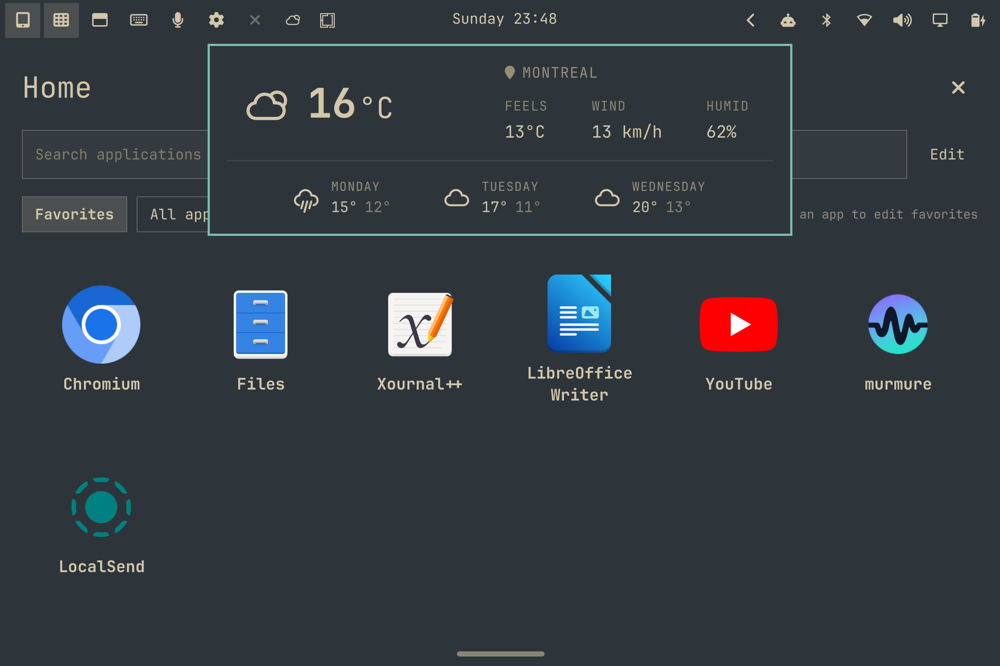

# Omarchy Tablet — présentation

**Une interface tactile pour Omarchy, avec retour au bureau d’un simple bouton.**

Omarchy Tablet facilite l’utilisation d’Omarchy sur une tablette ou un ordinateur à clavier détachable. Il rassemble un accueil avec favoris et recherche d’applications, un sélecteur de fenêtres, un clavier à l’écran et des raccourcis de dictée dans une interface intégrée aux thèmes et aux widgets du système.

En mode **Tablet**, la disposition **Single app** maximise l’application active sur l’écran intégré et rend les commandes tactiles accessibles. En mode **Desktop**, le plugin restaure les états de fenêtres qu’il avait modifiés pour retrouver la disposition en mosaïque d’Omarchy. **Hyprland reste le gestionnaire de fenêtres dans les deux modes.** Le mode **Automatic** suit la présence d’un clavier physique; le bouton en haut à gauche permet une bascule manuelle.

Le projet a été développé sur une **Surface Pro 4 avec le noyau linux-surface**. Il vise aussi les tablettes et convertibles capables de faire fonctionner une version compatible d’Omarchy, sous réserve de la prise en charge de leur matériel par Linux. La compatibilité avec d’autres modèles reste à tester.

Squeekboard fournit le clavier virtuel; Murmure ou une autre application configurable fournit la dictée. Le plugin ne remplace pas les pilotes matériels, ne gère pas lui-même la rotation automatique et ne réalise pas la reconnaissance vocale.

Licence MIT. Projet communautaire en préparation pour une première publication publique. Voir le [bilan de vérification](release-readiness.md) et les [instructions de publication](marketplace.md).

## English description

Omarchy Tablet brings a touch-friendly interface to Omarchy tablets and detachable computers. Switch between a tablet layout with one maximized application and Omarchy's normal desktop tiling, manually or automatically as a physical keyboard is attached or removed. A touch launcher, favorites, window switcher, Squeekboard integration and configurable dictation shortcuts keep everyday navigation within reach while preserving native widgets and themes. Developed on a Microsoft Surface Pro 4 running the linux-surface kernel; other compatible Omarchy devices are welcome for testing. Hyprland remains active in both modes.

## Short GitHub description

Touch-friendly tablet mode for Omarchy: app launcher, single-app layout, on-screen keyboard and dictation shortcuts. Built on Surface Pro 4 with linux-surface.

## Démonstration suggérée

1. Partir du bureau et toucher le bouton Tablet.
2. Ouvrir l’accueil et lancer une application.
3. Toucher un champ compatible pour afficher le clavier, puis le masquer.
4. Glisser depuis la poignée inférieure pour changer de fenêtre.
5. Montrer Settings : mode, activation du clavier et apparence.
6. Revenir à Desktop et montrer le retour à la mosaïque.
7. Après validation physique, montrer également Automatic avec détachement/rebranchement du clavier et une dictée réelle.

