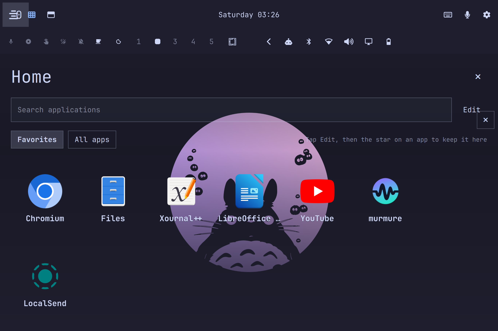
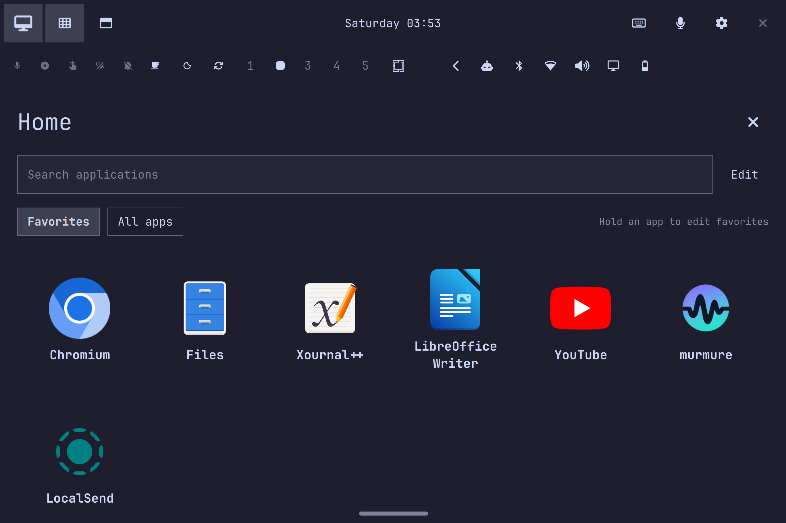
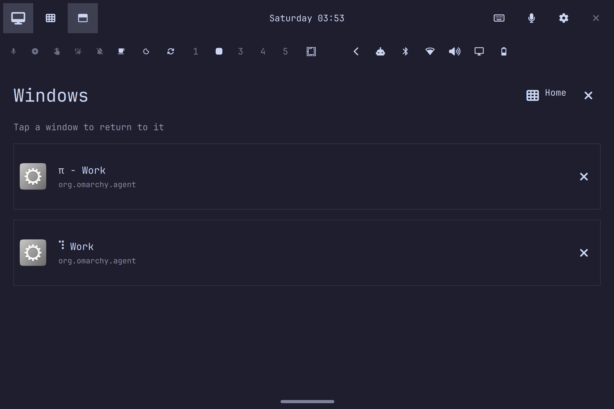
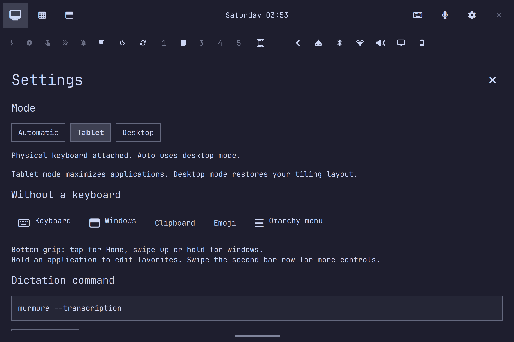

# Corrections et validation — 19 septembre 2026 (UTC)

> Historical development report. For the current behavior and release checks, see [README](../README.md) and [release readiness](release-readiness.md). Later sections may supersede earlier observations.

Reprise du travail construit avec pi / Claude / DeepSeek V4. Les modifications présentes dans le dépôt au début de cette intervention ont été conservées. Le plugin corrigé est installé sur la Surface ; les vérifications finales couvrent les deux modes.

## Bugs corrigés et causes

| Problème | Cause | Correction |
| --- | --- | --- |
| Switcher invisible | `SwitcherOverlay` était un `Item` sous la racine non affichée de la barre, sans fenêtre Wayland. | Contenu chargé dans la même véritable `PanelWindow` que l’accueil. |
| Travail graphique permanent | Accueil plein écran sous les applications, deuxième accueil au-dessus, bouton de fermeture dans une autre surface. | Accueil à la demande, surface opaque sans décodage de wallpaper ; fermeture intégrée à la barre. |
| Handlers dupliqués au changement de mode | Les deux loaders détruisaient/recréaient les widgets et leurs handlers IPC. | Une instance persistante par widget, changement de parent visuel avec `Instantiator`. |
| Horloge dans la mauvaise rangée | L’identité des objets issus de modèles QML n’est pas fiable entre les wrappers de propriétés. | Comparaison par ID de widget pour déterminer le parent. |
| Charge CPU malgré le passage aux événements | Hyprland répète `activewindowv2` quand le titre change : 50 répétitions observées en cinq secondes avec un terminal animé. | Filtrage de l’adresse active inchangée ; regroupement des événements utiles sur 40 ms. |
| Restauration manquée pour fenêtres déplacées/flottantes/fermées | Le cache ne considérait que l’adresse et le fullscreen actifs. | Réévaluation sur les événements pertinents, nettoyage des baux même sans fenêtre active. |
| Échec de dispatch non retenté | Le cache pouvait considérer l’état comme traité avant la réussite du dispatch. | L’état reste à réconcilier en cas d’erreur ; retry et journal de récupération conservés. |
| Nouvelle application restant maximisée en bureau | Omarchy transmet la maximisation à la nouvelle fenêtre avant son événement de focus ; elle pouvait être prise pour une fenêtre maximisée auparavant. | Distinction entre fenêtres initiales et nouvellement examinées, y compris quand la fenêtre est visible dans `clients` avant le focus. |
| Réutilisation d’une adresse de fenêtre | Une nouvelle identité pouvait conserver le bail d’un ancien objet. | Vérification de l’identité stable avant réconciliation et restauration. |
| Réglages de disposition sans effet | Les boutons changeaient une préférence ignorée par le mode automatique. | Disposition expliquée comme automatique ; l’ancien IPC `layout` sélectionne désormais le mode correspondant. |
| Accueil qui disparaît après activation tablette | La réponse asynchrone du mode fermait une vue venant d’être ouverte. | Fermeture automatique seulement lors du passage en bureau. |
| Dimensions natives figées | L’agrandissement tactile remplaçait les bindings natifs par une valeur capturée. | Binding temporaire réversible ; les dimensions natives se rétablissent en bureau et suivent la taille du texte. |
| Icônes erronées et cibles trop petites | Échappements Unicode incorrects et contrôles compacts. | Glyphes corrigés et vérifiés dans la police installée ; cibles principales d’au moins 48 px logiques. |
| Installation provoquant plusieurs reconstructions | Copie fichier par fichier dans l’arbre surveillé, puis rescan et reload immédiats. | Préparation hors surveillance, publication complète et attente du watcher avant un rescan de secours. |
| Préférences JSON de mauvais type | Du JSON valide autre qu’un objet faisait planter l’initialisation. | Validation de la forme des préférences et des valeurs de mode/disposition. |

Les cartes de fenêtres affichent des icônes et titres, sans fausses miniatures « live ». Le fond du bureau Omarchy reste inchangé ; l’accueil du plugin utilise les couleurs opaques du thème. L’[architecture actuelle](architecture.md) détaille ces choix.

## Mesures

| Indicateur | Avant | Après |
| --- | --- | --- |
| Surfaces du plugin, application active en tablette | 4 | 2 |
| Surfaces du plugin, accueil ouvert | 5 | 3 |
| CPU du backend au repos, fraction d’un cœur | 0,8 % sur 5 s | 0,1 % sur 10 s |
| CPU de Quickshell dans ces échantillons | 3,0 % | 2,9 % |
| Surveillance du layout au repos | `hyprctl activewindow` toutes les 0,5 s | Aucune requête layout sans événement utile, sauf secours si socket déconnecté |
| Surveillance systemd du clavier | À chaque boucle | Au plus une fois toutes les 5 s |

Ce sont des échantillons successifs courts, hors CPU des sous-processus, pas un benchmark contrôlé. Le total CPU du shell est pratiquement inchangé. Les appels de rotation de la dernière suite ont une médiane de **8,3 ms** : cela mesure le retour de la commande, **pas** le temps jusqu’à l’image affichée ni les FPS. La fluidité ressentie pendant un mouvement réel de la Surface reste à confirmer.

Sources locales : [mesures CPU](performance-results.json), [résultats live](live-results.json).

## Parcours exécutés

L’outil « Computer Views » n’était pas exposé dans cette session. Les tests ont utilisé la vraie session Hyprland, des captures `grim` inspectées, les IPC du shell, `wtype` et un petit client de pointeur Wayland. Les clics et glissements sont synthétiques ; ils ne simulent pas fidèlement un doigt ou un stylet.

| Étape | État | Preuve |
| --- | --- | --- |
| 1. Bureau → tablette → bureau, plusieurs fois | OK | Clics réels sur le toggle, clavier libéré en bureau, 14 widgets uniques chargés dans chaque mode ; [barre bureau](screenshots/15-desktop-bar.png). |
| 2. Accueil, recherche, favoris | OK | Recherche « localsend » saisie dans le champ ; retrait/réajout par appui long, ordre initial restauré ; [recherche](screenshots/12-search.png). |
| 3. Lancement et fermeture | OK | Files lancé depuis sa tuile, accueil fermé, nouvelle fenêtre refermée avec ✕ ; terminal jetable maximisé puis restauré au tiling. Aucune fenêtre personnelle fermée. |
| 4. Fenêtres et geste inférieur | OK | Bouton Windows, tap sur poignée, glissement vers le haut, exclusivité avec Home/Settings ; [fenêtres](screenshots/10-windows-final.png). |
| 5. Paramètres et raccourcis sans clavier | OK | Clics sur Settings, presse-papiers, emoji et menu Omarchy ; surfaces natives constatées puis fermées sans sélectionner de contenu ; [paramètres](screenshots/11-settings-final.png). |
| 6. Clavier | OK | Affichage/masquage par IPC/D-Bus ; ouverture automatique dans un champ GTK jetable, saisie Wayland vérifiée par le nombre de caractères. |
| 7. Widgets natifs | OK pour le cycle des panneaux | Audio, Bluetooth, réseau, énergie, horloge, moniteur et agents ouverts/fermés. Les changements réseau, appairages et autres actions métier ne sont pas tous testés. |
| 8. Rotation | OK pour les transformations logicielles | Transformations 0, 1, 3 vérifiées sur le véritable écran ; [paysage](screenshots/09-landscape-final.png), [portrait](screenshots/07-portrait-home.png), [portrait inverse](screenshots/08-portrait-inverted.png). |
| 9. Thème et taille de texte | OK | Portrait à 12/20, palette claire et sombre ; [petit texte](screenshots/13-portrait-small-text.png), [palette claire](screenshots/14-portrait-light.png). Préférences initiales restaurées. |
| 10. Mode automatique | OK pour le matériel actuellement connecté | État tablette cohérent avec la présence du clavier physique. Les topologies attaché/détaché ont aussi des tests unitaires. |
| 11. Redémarrage et installation | OK | Version du backend publiée vérifiée, redémarrage à froid puis suite live complète réussie. Retour final au bureau, orientation 0 et autorotation active. |

### Avant / après

L’ancien accueil montrait un bouton de fermeture supplémentaire superposé aux actions :



L’accueil final réduit le bruit visuel, garde la hiérarchie native et rend la poignée visible :







## Tests et journal

- **36 tests unitaires réussis**, compilation de tous les fichiers Python du projet et des scripts réussie.
- `qmllint` : **0 diagnostic Error**, mais pas zéro warning. Les métadonnées statiques Omarchy exposent les groupes `Style`/`Color` comme `QObject` et Quickshell déclare certains types différemment à l’exécution. Le lint rapporte 117 `missing-property`, 3 `uncreatable-type`, 7 accès non qualifiés et 1 paramètre `QProcess::ExitStatus`. Les composants ont été validés dans le shell réel ; le résultat du lint n’est pas présenté comme entièrement vert.
- **Zéro erreur et zéro avertissement Quickshell pendant la fenêtre de validation finale démarrée à 03:53:23 UTC**, comprenant les basculements, panneaux, rotations et gestes après redémarrage à froid. [Journal conservé](final-shell-journal.txt).
- Des avertissements historiques de contextes QML détruits pendant des reloads et de `Qt.atob` déprécié lors des essais de palette ont été observés dans le shell hôte. Ils ne sont pas effacés ni attribués à tort à cette validation finale. Aucun correctif du shell empaqueté n’a été tenté.

## Vérifications humaines restantes

- Rotation physique à l’accéléromètre : stabilité près des seuils, absence de saccades perceptibles, précision tactile et stylet après rotation. Aucun relevé GPU/frame-time n’a été réalisé.
- Détachement/reconnexion physique du Type Cover, veille/réveil et usage prolongé sur batterie.
- Dictée parlée : lancement et configuration de commande ont une couverture, mais reconnaissance, qualité d’insertion et microphone n’ont pas été validés avec de la parole.
- Écran externe réel et cas d’applications particulières. Les exclusions de layout ont une couverture unitaire, sans deuxième écran physique disponible.
- Accessibilité complète au lecteur d’écran et confort réel au doigt. Les tailles de cibles et le rendu sont contrôlés, pas une conformité exhaustive.

## Reproduire

```sh
python3 -m py_compile *.py scripts/*.py
python3 -m unittest discover -s tests -v
/usr/lib/qt6/bin/qmllint -I /usr/lib/qt6/qml -I /tmp/qsimpl *.qml
python3 install.py
python3 scripts/live_smoke.py
python3 scripts/check_input.py
```

Le test live restaure mode, orientation et autorotation dans `finally`. Il suppose les 14 widgets de la configuration Surface actuelle. Son option de clics utilise les coordonnées de cette Surface à l’échelle 2.

Pour compiler le client de pointeur optionnel, utiliser le [protocole officiel wlr-virtual-pointer](https://github.com/swaywm/wlr-protocols/blob/master/unstable/wlr-virtual-pointer-unstable-v1.xml), puis :

```sh
curl -fsSL https://raw.githubusercontent.com/swaywm/wlr-protocols/master/unstable/wlr-virtual-pointer-unstable-v1.xml -o /tmp/tablet-pointer.xml
wayland-scanner client-header /tmp/tablet-pointer.xml /tmp/tablet-pointer.h
wayland-scanner private-code /tmp/tablet-pointer.xml /tmp/tablet-pointer-protocol.c
cc -Wall -Wextra scripts/wayland_pointer.c /tmp/tablet-pointer-protocol.c -I /tmp -lwayland-client -o /tmp/tablet-pointer
python3 scripts/live_smoke.py --pointer /tmp/tablet-pointer
```
